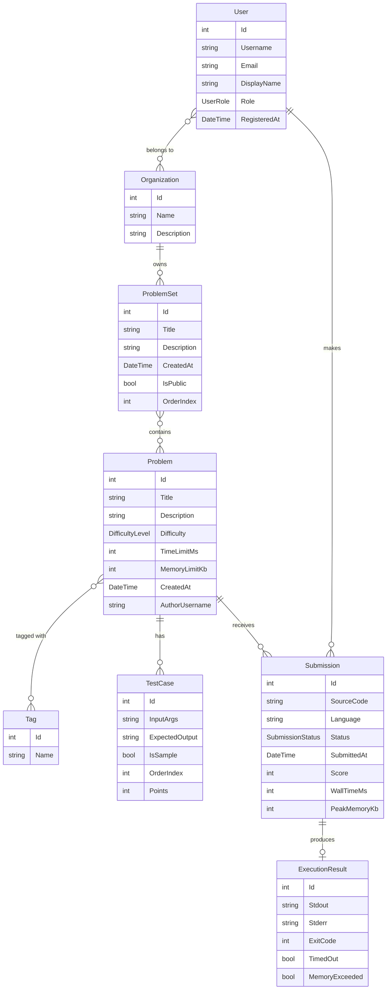

# Domain Model

All classes live in `WebIde.Model`. The model is a pure class library with no framework dependencies — it can be referenced by any layer.

## Enums

### `DifficultyLevel`
Classifies problem difficulty.
```
Easy | Medium | Hard
```

### `SubmissionStatus`
Tracks the lifecycle of a code submission.
```
Pending → Running → Accepted
                  → WrongAnswer
                  → TimeLimitExceeded
                  → MemoryLimitExceeded
                  → CompileError
```

### `UserRole`
Controls what a user can do on the platform.
```
Admin | Instructor | Student
```

---

## Classes

### `User`
A registered platform user.

| Property | Type | Notes |
|---|---|---|
| Id | int | |
| Username | string | required |
| Email | string | required |
| DisplayName | string | required |
| Role | UserRole | |
| RegisteredAt | DateTime | |
| Submissions | List\<Submission\> | 1-N: user has many submissions |
| Organizations | List\<Organization\> | N-N: user belongs to many orgs |

---

### `Organization`
A group of users — represents a course, team, or institution.

| Property | Type | Notes |
|---|---|---|
| Id | int | |
| Name | string | required |
| Description | string | required |
| Members | List\<User\> | N-N with User |
| ProblemSets | List\<ProblemSet\> | 1-N: org owns many problem sets |

---

### `Problem`
A coding problem with a description and constraints.

| Property | Type | Notes |
|---|---|---|
| Id | int | |
| Title | string | required |
| Description | string | required |
| Difficulty | DifficultyLevel | |
| TimeLimitMs | int | execution time cap per submission |
| MemoryLimitKb | int | memory cap per submission |
| CreatedAt | DateTime | |
| AuthorUsername | string | required |
| TestCases | List\<TestCase\> | 1-N: problem has many test cases |
| Tags | List\<Tag\> | N-N: problem has many tags |
| Submissions | List\<Submission\> | 1-N: problem has many submissions |

---

### `Tag`
A label for categorizing problems (e.g. "Arrays", "Binary Search").

| Property | Type | Notes |
|---|---|---|
| Id | int | |
| Name | string | required |
| Problems | List\<Problem\> | N-N with Problem |

---

### `TestCase`
A single input/output pair used to judge a submission.

| Property | Type | Notes |
|---|---|---|
| Id | int | |
| InputArgs | string | required — serialized input (e.g. JSON array) |
| ExpectedOutput | string | required |
| IsSample | bool | true = shown to user; false = hidden judge-only |
| OrderIndex | int | display/execution order |
| Points | int | partial scoring weight |
| Problem | Problem | required — owning problem |

---

### `Submission`
One attempt by a user to solve a problem.

| Property | Type | Notes |
|---|---|---|
| Id | int | |
| SourceCode | string | required |
| Language | string | required — e.g. "cpp", "c" |
| Status | SubmissionStatus | |
| SubmittedAt | DateTime | |
| Score | int | 0–100, based on passing test cases |
| WallTimeMs | int | measured execution time |
| PeakMemoryKb | int | measured peak memory |
| User | User | required |
| Problem | Problem | required |
| ExecutionResult | ExecutionResult? | null while status is Pending/Running |

---

### `ExecutionResult`
Raw output from the sandbox for a submission.

| Property | Type | Notes |
|---|---|---|
| Id | int | |
| Stdout | string | required |
| Stderr | string | required |
| ExitCode | int | 0 = clean exit |
| TimedOut | bool | true if wall time exceeded limit |
| MemoryExceeded | bool | true if peak memory exceeded limit |

---

### `ProblemSet`
An ordered collection of problems — used for courses or curated playlists.

| Property | Type | Notes |
|---|---|---|
| Id | int | |
| Title | string | required |
| Description | string | required |
| CreatedAt | DateTime | |
| IsPublic | bool | controls visibility to non-members |
| OrderIndex | int | ordering within the organization |
| Organization | Organization | required — owning org |
| Problems | List\<Problem\> | N-N with Problem |

---

## Relationships



Key relationships:
- **1-N**: Problem → TestCases, Problem → Submissions, User → Submissions, Organization → ProblemSets
- **N-N**: Problem ↔ Tag, Problem ↔ ProblemSet, User ↔ Organization
- `ExecutionResult` is nullable on `Submission` — it only exists after the sandbox has finished running
